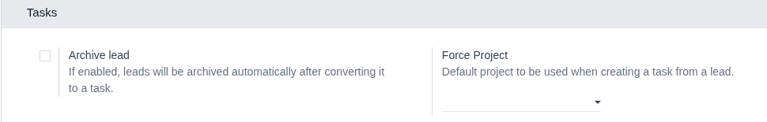
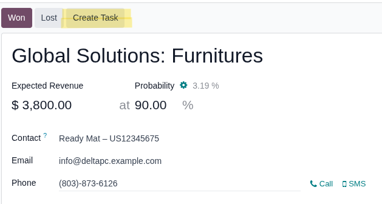
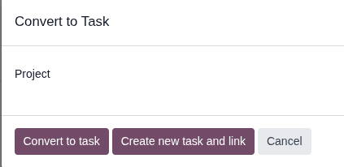

1. Open the CRM settings and configure:
    - Force Project: If set, "Project" field will be preselected on the creation wizard
        and the field will be readonly.
    - Archive Lead: If enabled, the lead will be archived after converting it to a task.

    

2. Navigate to *CRM \> Sales \> My pipeline*
3. Open an existing lead or create a new one. 
4. Once in the lead, click to the "Create Task" button.

    

5. When clicking the button, a pop up will appear:
    - It will have a "Project" field. This field will
        become preselected if "Force Project" is configured.
    - "Convert to task" button: This button will convert the lead to a Task.
        This includes archive the lead if configured and pass the chatter to the new task
    - "Create new task and link" button: This button creates a new task
        and link it to the current lead. This will ignore the archive configuration
        and will not include the chatter in the new task. 

    

6. After creation, you will be redirected to the new task form view.
